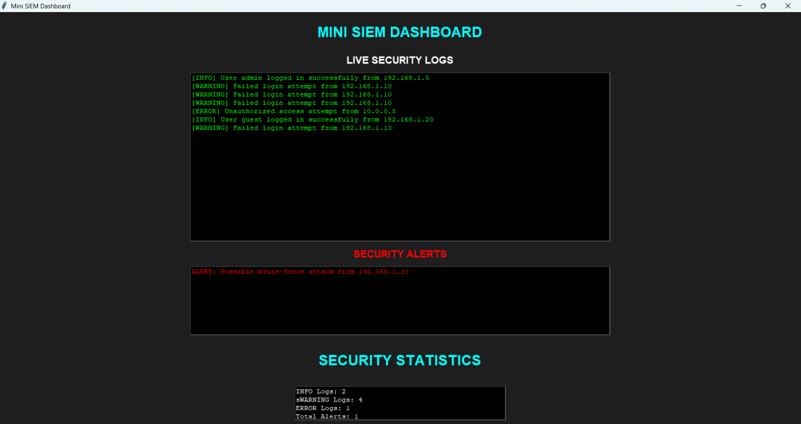

# Mini SIEM Dashboard

A Python-based Mini SIEM (Security Information and Event Management) Dashboard built for cybersecurity monitoring and log analysis.

This project simulates basic SOC (Security Operations Center) functionality by analyzing security logs, detecting suspicious activity, generating alerts, and displaying security statistics inside a GUI dashboard.

---

## Features

- Live security log monitoring
- Log parsing and classification
- INFO / WARNING / ERROR event detection
- Failed login tracking
- Brute-force attack detection
- Alert generation system
- Alert logging to file
- Security statistics dashboard
- Dark-themed cybersecurity GUI

---

## Technologies Used

- Python
- Tkinter
- File Handling

---

## How It Works

The dashboard reads logs from:

```text
security_logs.txt
```

It then:

1. Parses security events
2. Categorizes logs
3. Tracks failed login attempts
4. Detects suspicious repeated login failures
5. Generates security alerts
6. Displays logs and alerts in a GUI dashboard
7. Shows security statistics

---

## Detection Logic

The SIEM detects potential brute-force attacks when an IP address exceeds the failed login threshold.

Example:

```text
ALERT: Possible brute-force attack from 192.168.1.10
```

---

## Dashboard Sections

### Live Security Logs
Displays incoming security events in real time.

### Security Alerts
Shows detected suspicious activity and generated alerts.

### Security Statistics
Displays:
- INFO log count
- WARNING log count
- ERROR log count
- Total alerts generated

---

## Example Logs

```text
[INFO] User admin logged in successfully from 192.168.1.5
[WARNING] Failed login attempt from 192.168.1.10
[ERROR] Unauthorized access attempt from 10.0.0.5
```

---

## Files

```text
mini_siem.py
security_logs.txt
alerts.txt
README.md
```

---

## How To Run

Run the dashboard:

```bash
python mini_siem.py
```

---

## Screenshot



---

## Educational Purpose

This project was created for educational and cybersecurity learning purposes only.

---

## Author

Ashmit Chaudhary
